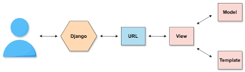
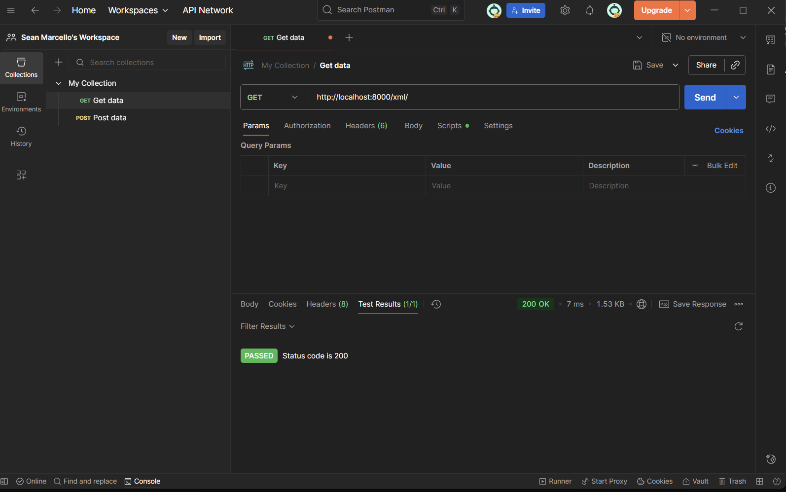

# Tugas 2

Link aplikasi PWS: https://sean-marcello-footballshop.pbp.cs.ui.ac.id/

1. Jelaskan bagaimana cara kamu mengimplementasikan checklist di atas secara step-by-step.

Pertama buat dahulu direktori lokal untuk proyek saya, lalu melakukan inisiasi dengan git init.
Lalu buat repositori daring di github beserta branch utama dan menghubungkan kedua repositori tersebut dengan menambahkan remote. 
Selanjutnya saya membuat virtual env dan membuat berkas pada requiirements.txt yang berisi dependencies yang digunakan pada proyek, lalu menginstallnya pada v env. Barulah saya membuat proyek Dango baru saya yang berjudul football-shop. Di sana saya juga mengatur env variables, production configuration, dan settings. 

Selanjutnya, saya membuat aplikasi dengan nama main dengan "python manage.py startapp main" dan menambahkan 'main' pada INSTALLED_APPS di settings.py.

Setelah itu, saya membuat model pada aplikasi main dengan nama class Product dan menambahkan keenam atribut yang diminta beserta tipenya. Saya juga menambahkan CATEGORY_CHOICES yang sesuai dengan konteks proyek saya dan magic method yang mereturn nama produk untuk mendefine representasi string pada model.

Pada views.py, saya membuat berkas main.html yang menampilkan nama aplikasi, nama, dan kelas saya lalu menambahkan fungsi dengan nama show_main yang berisi data yang say tampilkan pada berkas main.html.

Saya melakukan routing dengan membuat konfigurasi routing untuk aplikasi main pada berkas urls.py di direktori main, lalu saya tambahkan url tersebut pada url tingkat proyek, sehingga aplikasi main dapat dijalankan.

Akhirnya, saya melakukan deployment melalui pws dengan membuat proyek baru pada pws, menyimpan credentials. Pada environs dan melakukan kofnigurasi project env variables sesuai yang sudah saya buat sebelumnya. Lalu saya menambahkan url deployemnt pada pws dan akhirnya melakukan add, commit, dan push pada git.

2. Buatlah bagan yang berisi request client ke web aplikasi berbasis Django beserta responnya dan jelaskan pada bagan tersebut kaitan antara urls.py, views.py, models.py, dan berkas html.

Penjelasan:

Saat pengguna mengakses aplikasi Django melalui sebuah URL, permintaan tersebut diproses oleh arsitektur MVT, di mana URL mapper (urls.py) akan mencocokkan alamat yang diminta dan meneruskannya ke View yang tepat. Jika view yang sesuai ditemukan, maka view tersebut akan dipanggil untuk memproses permintaan. Dalam prosesnya, View dapat berinteraksi dengan Model untuk mengambil data yang diperlukan dari database. Setelah data berhasil diambil, View akan memanfaatkan Template untuk merender halaman dengan menyisipkan data tersebut ke dalam HTML, lalu hasil akhirnya dikirim kembali ke pengguna dalam bentuk respon.

referensi: https://www.educative.io/answers/what-is-mvt-structure-in-django

3. Jelaskan peran settings.py dalam proyek Django!
Dalam proyek Django, berkas settings.py berfungsi sebagai pusat pengaturan yang mengatur bagaimana aplikasi dijalanakan. Di dalamnya terdapat berbagai kofnigurasi, seperti jenis basis data yang digunakan (pada DATABASES), daftar aplikasi yang diaktifkan pada proyek (pada INSTALLED_APPS), serta pengaturan keamanan seperti SECRET_KEY dan ALLOWED_HOSTS.
Secara garis besar, settings.py menjadi pusat konfigurasi yang memastikan setiap komponen dalam proyek Django dapat bekerja sesuai kebutuhan, baik dalam tahap pengembangan maupun ketika dijalankan di lingkungan produksi.

4. Bagaimana cara kerja migrasi database di Django?
Migrasi dilakukan untuk menyesuaikan perubahan pada model di models.py dengan struktur tabel di database. Ketika sebuah model diinisiasi atau dimodifikasi, perintah python manage.py makemigrations akan menghasilkan file migrasi yang berisi instruksi mengenai perubahan tersebut. Kemudian,pada perintah python manage.py migrate, instruksi tersebut dijalankan dan diterjemahkan menjadi perintah SQL yang sesuai sehingga database diperbarui. Django juga mencatat setiap migrasi yang sudah dilakukan dalam tabel django_migrations, sehingga sistem dapat mengetahui bagian mana yang sudah sinkron.

5. Menurut Anda, dari semua framework yang ada, mengapa framework Django dijadikan permulaan pembelajaran pengembangan perangkat lunak?
Django sering dijadikan framework pertama dalam pembelajaran pengembangan perangkat lunak karena fiturnya yang lengkap dan mudah dipahami. Django telah menyediakan berbagai kebutuhan dasar seperti routing, autentikasi, dan pengelolaan basis data, sehingga kita tidak perlu membangun semuanya dari awal. Strukturnya yang menggunakan Model–Template–View membantu memisahkan bagian data, logika, dan tampilan secara jelas. Selain itu, Django menggunakan bahasa Python yang memiliki sintaks sederhana sehingga lebih mudah dipelajari oleh mahasiswa. Ditambah lagi, dokumentasinya sangat baik, komunitasnya luas, serta banyak digunakan di industri besar, sehingga pembelajaran Django tidak hanya memperkenalkan dasar pengembangan web, tetapi juga membiasakan mahasiswa dengan praktik terbaik yang sesuai dengan kebutuhan dunia kerja.

6. Apakah ada feedback untuk asisten dosen tutorial 1 yang telah kamu kerjakan sebelumnya? tidak ada hehe

# Tugas 3

1. Jelaskan mengapa kita memerlukan data delivery dalam pengimplementasian sebuah platform?
Data delivery diperlukan agar setiap bagian dalam sebuah platform, seperti tampilan depan (frontend), server (backend), dan layanan pihak ketiga, dapat saling bertukar informasi dengan cara yang teratur dan aman, sehingga proses komunikasi dan integrasi sistem berjalan lancar.

2. Menurutmu, mana yang lebih baik antara XML dan JSON? Mengapa JSON lebih populer dibandingkan XML?
JSON lebih populer dibanding XML karena formatnya lebih sederhana, mudah dibaca, ukuran datanya lebih kecil, dan lebih cepat diproses, terutama di JavaScript, sedangkan XML cenderung panjang dan lebih rumit meskipun cocok untuk dokumen yang kompleks.

3. Jelaskan fungsi dari method is_valid() pada form Django dan mengapa kita membutuhkan method tersebut?
is_valid() berfungsi untuk memeriksa apakah data yang diisi pada form sudah benar dan sesuai aturan, lalu menyediakan data yang sudah bersih agar dapat disimpan ke database tanpa kesalahan.

4. Mengapa kita membutuhkan csrf_token saat membuat form di Django? Apa yang dapat terjadi jika kita tidak menambahkan csrf_token pada form Django? Bagaimana hal tersebut dapat dimanfaatkan oleh penyerang?
csrf_token digunakan untuk melindungi aplikasi dari serangan Cross-Site Request Forgery dengan memberikan token unik pada setiap form, sehingga permintaan yang tidak sah dari pihak luar akan ditolak dan data pengguna tetap aman. Jika csrf_token  tidak ditambahkan, aplikasi rentan serangan CSRF di mana penyerang bisa membuat pengguna yang sedang login mengirim permintaan palsu (misalnya mengubah data atau melakukan transaksi) karena server mengira permintaan tersebut sah.

5. Jelaskan bagaimana cara kamu mengimplementasikan checklist di atas secara step-by-step (bukan hanya sekadar mengikuti tutorial).
Dari tutorial sebelumnya, saya membuat skeleton terlebih dahulu sebagai kerangka views. Saya membuat direktori templates pada root folder dengan base.html dan melakukan penambahan direktori tersebut pada TEMPLATES di settings.py.

Lalu, saya membbuat struktur form pada forms.py yang memiliki fields: "name", "price", "description", "thumbnail", "category", "is_featured". Kemudian, saya membuat fungsi pada views.py: create_product untuk menambahkan data Product ketika data disubmit dari form dan show_product untuk menampilkan informasi detail produk. Fungsi tersebut saya import ke urls.py dan menambahkan path URL pada urlpattens.

Saya memperbarui main.html; menambahkan tombol add untuk mendirect ke halaman menambah produk serta menampilkan semua produk yang sudah ditambahkan dan menambahkan tombol detail untuk mendirect pada halaman detail produk.
Saya juga membuat file html baru: create_product.html untuk halaman form input dan product_detail.html dan detail produk.

Untuk mengembalikan data dalam bentuk xml dan json, pertama saya melakukan import HttpResponse dan Serializer. Pada views.py, saya membuat fungsi show_xml yang mereturn HttpResponse yang berisi parameter data hasil query yang sudah diserialisasi menjadi XML dan juga fungsi show_json yang mereturn HttpResponse yang berisi parameter data hasil query yang sudah diserialisasi menjadi JSON.
Lalu saya mengimport fungsi tersebut pada  urls.py dan menambahakn path url untuk mengakses fungsi tersebut.

Terakhir, pada views.py juga saya membuat fungsi baru yang menerima parameter request dan news_id dengan nama show_xml_by_id dan show_json_by_id. Di dalam fungsi tersebut, saya membuat sebuah variabel product_item untuk menyimpamn hasil query dari daata dengan id tertentu pada Product. Hasil return fungsi tersebut adalah berupa HttpResponse yang berisi parameter data hasil query yang sudah diserialisasi menjadi JSON atau XML. Saya juga membuat try except untuk mengantisipasi jika data tidak ditemukan dalam basis data. Lalu, saya mengimport fungsi tersebut dan menamabhakn path url pada urls.py

6. Apakah ada feedback untuk asdos di tutorial 2 yang sudah kalian kerjakan? tidak ada hehe

Screenshot Postman:

XML:

JSON:

# Tugas 4

1. Apa itu Django AuthenticationForm? Jelaskan juga kelebihan dan kekurangannya.
AuthenticationForm adalah formulir bawaan Django untuk proses login pengguna yang menyediakan field username dan password, lalu memvalidasi keduanya dengan fungsi authenticate(). 
Kelebihannya yaitu proses login menjadi aman dan praktis, keamanannya sudah teruji, integrasi mudah dengan `LoginView`, dan terdapat dukungan berbagai backend autentikasi. 
Namun, form ini hanya dirancang untuk login, sehingga tidak bisa dipakai untuk registrasi pengguna baru. Tampilan defaultnya sangat sederhana sehingga hampir selalu perlu diubah agar sesuai desain aplikasi, dan fitur ekstra seperti “remember me”, pembatasan percobaan login, atau autentikasi ganda harus ditambahkan secara manual atau dengan paket pihak ketiga.

2. Apa perbedaan antara autentikasi dan otorisasi? Bagaiamana Django mengimplementasikan kedua konsep tersebut?
Autentikasi memastikan siapa pengguna (verifikasi identitas), sedangkan otorisasi menentukan apa yang boleh dilakukan pengguna itu (hak akses). Contohnya yaitu login dengan username/password adalah autentikasi, mengecek apakah pengguna boleh mengakses halaman admin adalah otorisasi.

Django menangani autentikasi dengan sistem login bawaan yang memeriksa identitas pengguna melalui fungsi seperti authenticate() dan login(). Setelah berhasil, Django menyimpan status login di sesi dan menyediakan objek request.user agar aplikasi tahu siapa yang sedang masuk.

Django menangani otorisasi dengan sistem perizinan (permissions) dan group. Setiap user bisa diberi hak akses tertentu, misalnya menambah, mengubah, atau menghapus data. Pengecekan hak ini dilakukan dengan cara seperti @login_required atau user.has_perm(). Django memastikan hanya pengguna yang berwenang yang dapat mengakses atau mengubah bagian tertentu dari aplikasi.

3. Apa saja kelebihan dan kekurangan session dan cookies dalam konteks menyimpan state di aplikasi web?

Cookies menyimpan data langsung di sisi klien sehingga ringan, tidak membebani server, dan cocok untuk informasi kecil. Namun, cookies memiliki batas ukuran, selalu dikirim pada setiap request sehingga berpotensi menambah beban jaringan, dan rentan dimanipulasi atau dicuri jika tidak diamankan (misalnya tanpa HttpOnly atau HTTPS).

Session menyimpan data di server dan hanya mengirimkan kode ID sesi ke browser, jadi lebih aman dari perubahan oleh pengguna dan bisa menyimpan data lebih besar atau penting seperti info login. Kekurangannya, session butuh tempat penyimpanan dan pengelolaan di server, serta perlu pengaturan tambahan jika aplikasi dijalankan di banyak server agar semua server bisa berbagi data sesi.

4. Apakah penggunaan cookies aman secara default dalam pengembangan web, atau apakah ada risiko potensial yang harus diwaspadai? Bagaimana Django menangani hal tersebut?

Cookies tidak otomatis aman karena ada beberapa risiko. Misalnya, cookie bisa dicuri lewat script jahat di halaman (XSS), dipakai untuk serangan lintas situs (CSRF), atau disadap kalau koneksi tidak memakai HTTPS. Penyerang juga bisa mencoba memaksa orang lain memakai ID sesi tertentu (session fixation).

Django menyiapkan perlindungan untuk masalah ini. Secara bawaan cookie sesi dibuat HttpOnly supaya tidak bisa dibaca JavaScript, dan kita bisa mengaktifkan SESSION_COOKIE_SECURE agar cookie hanya dikirim lewat HTTPS. Ada juga pengaturan SESSION_COOKIE_SAMESITE dan middleware CSRF untuk mencegah serangan CSRF, serta rotasi ID sesi saat login agar ID lama tidak bisa dipakai orang lain.

5. Jelaskan bagaimana cara kamu mengimplementasikan checklist di atas secara step-by-step (bukan hanya sekadar mengikuti tutorial).

a. Mengimplementasikan fungsi registrasi, login, dan logout untuk memungkinkan pengguna mengakses aplikasi sebelumnya sesuai dengan status login/logoutnya.

Registrasi
Pada views.py, import UserCreationForm dan messages. Lalu saya membuat fungsi register untuk menghasilkan formulir registrasi secara otomatis dan menghasilkan akun pengguna ketika data di-submit dari form. Pada folder template, saya menambahkan file html baru bernama register.html. Lalu saya routing fungsi tersebut dengan menambahkan path url ke dalam urlpatterns di urls.py.

Login
- Pada views.py, import authenticate, login, dan AuthenticationForm. Lalu saya menambahkan fungsi login_user yang berfungsi untuk mengautentikasi pengguna yang ingin login. Pada folder template, saya menambahkan file html baru bernama login.html. Lalu saya routing fungsi tersebut dengan menambahkan path url ke dalam urlpatterns di urls.py.

Logout
- Pada views.py, import logout. Lalu saya menambahkan fungsi logout_user yang berfungsi untuk melakukan mekanisme logout. Pada folder template, saya menambahkan tombol Logout. Lalu saya routing fungsi tersebut dengan menambahkan path url ke dalam urlpatterns di urls.py.

Lalu untuk mengatur agar bisa mengakses halaman main dan product_details: import login_required lalu jadikan sebagai decorator fungsi show_main dan show_product.

b. Menampilkan detail informasi pengguna yang sedang logged in seperti username dan menerapkan cookies seperti last_login pada halaman utama aplikasi.

Pada views.py, import HttpResponseRedirect, reverse, dan datetime. Lalu lakukan modifikasi pada fungsi login_user dengan menambahkan:
login(request, user)
response = HttpResponseRedirect(reverse("main:show_main"))
response.set_cookie('last_login', str(datetime.datetime.now()))
response.set_cookie('current_user', user.username)

Pada fungsi show_main, tambahkan pada context:

'last_login': request.COOKIES.get('last_login', 'Never'),
'current_user': request.COOKIES.get('current_user', 'Anonymous')
Lalu pada fungsi logout_user, modifikasi kode untuk menghapus cookie last_login setelah melakukan logout:
response.delete_cookie('last_login')
Di main.html, saya menambahkan pesan yang menampilkan nama user yang sedang login dan waktu terakhir login.

c. Menghubungkan model Product dengan User

Pada models.py, import User. Lalu pada model Product, saya menambahkan:
user = models.ForeignKey(User, on_delete=models.CASCADE, null=True) 
Setelah itu saya melakukan migrasi dengan python manage.py makemigrations dan python manage.py migrate.
Pada fungsi create_product yang berada di views.py, modifikasi kode sehingga setiap objek yang dibuat akan secara otomatis terhubung dengan pengguna yang membuatnya. Saya juga mengodifikasi show_main agar bisa memfilter list produk berdasarkan merchant.
Pada main.html, saya membuat tombol All Products utnuk menampilkan semua produk dan My products untuk emnampilkan produk yang dijual merchatn/ user yang sedang logged in.
Terakhir, pada product_details.html, saya menambahkan informasi nama merchant yang menjual produk tersebut.

d. Membuat dua (2) akun pengguna dengan masing-masing tiga (3) dummy data menggunakan model yang telah dibuat sebelumnya untuk setiap akun di lokal.

buat dulu akun pengguna dan passwordnya (register), lalu login dengan username dan password yang telah dibuat. Buat product dengan klik tombol Add dan masukkan detail product. setelah selesai klik Add Product. Lakukan 3 kali. Setelah itu, buat lagi akun baru dan ulangi seperti sebelumnya :D

# Tugas 5

1. Jika terdapat beberapa CSS selector untuk suatu elemen HTML, jelaskan urutan prioritas pengambilan CSS selector tersebut!
Ketika ada beberapa CSS selector yang berlaku pada satu elemen, browser akan memilih yang paling spesifik. Urutannya dimulai dari inline style, lalu ID selector, kemudian class, pseudo-class, atau attribute selector, dan terakhir element selector seperti div atau p. Jika dua selector memiliki tingkat spesifisitas yang sama, maka aturan yang ditulis paling akhir di file CSS akan dipakai. Jadii, semakin spesifik selector yang digunakan, semakin tinggi prioritasnya dalam menentukan gaya elemen.

2. Mengapa responsive design menjadi konsep yang penting dalam pengembangan aplikasi web? Berikan contoh aplikasi yang sudah dan belum menerapkan responsive design, serta jelaskan mengapa!
Responsive design penting karena membuat tampilan web menyesuaikan ukuran layar pengguna, baik di laptop, tablet, maupun smartphone. Jika sebuah web tidak responsive, maka di perangkat kecil seperti HP tampilannya bisa berantakan, teks sulit dibaca, dan tombol susah diklik. 
Contoh aplikasi yang sudah menerapkan responsive design adalah Instagram, yang pada layar laptop menampilkan galeri dalam beberapa kolom, tetapi otomatis menjadi satu kolom ketika dibuka di HP. Sebaliknya, banyak website lama atau forum jadul tidak responsive, sehingga harus digeser ke kanan-kiri di HP. Dengan semakin banyaknya orang yang mengakses web lewat smartphone, responsive design menjadi hal yang wajib agar pengalaman pengguna tetap nyaman.

3. Jelaskan perbedaan antara margin, border, dan padding, serta cara untuk mengimplementasikan ketiga hal tersebut!
Margin adalah jarak di luar elemen, yaitu ruang kosong antara elemen satu dengan elemen lainnya. Border adalah garis atau batas di sekeliling elemen yang memisahkan isi elemen dengan area di luar elemen. Sementara padding adalah jarak antara isi elemen dengan border. Misalnya, jika kita membuat sebuah kotak dengan teks, padding akan memberi ruang di dalam kotak agar teks tidak menempel ke tepi border, border akan menjadi garis pembatas kotak, dan margin akan memberi jarak kotak tersebut dari elemen lain di sekitarnya.

Implementasi margin:
.box {
  margin: 20px;         /* jarak semua sisi 20px */
  margin-top: 10px;     /* jarak atas */
  margin-right: 15px;   /* jarak kanan */
  margin-bottom: 20px;  /* jarak bawah */
  margin-left: 5px;     /* jarak kiri */
}

implementasi border:
.box {
  border: 2px solid black;        /* border hitam tebal 2px */
  border-radius: 8px;             /* sudut kotak dibulatkan */
  border-top: 3px dashed red;     /* border atas saja, garis putus-putus */
}

implementasi padding:
.box {
  padding: 15px;          /* jarak semua sisi 15px */
  padding-top: 10px;      /* jarak atas */
  padding-right: 20px;    /* jarak kanan */
  padding-bottom: 10px;   /* jarak bawah */
  padding-left: 5px;      /* jarak kiri */
}

4. Jelaskan konsep flex box dan grid layout beserta kegunaannya!
Flexbox dan grid layout adalah dua cara modern untuk mengatur tata letak di CSS. Flexbox digunakan untuk mengatur elemen dalam satu dimensi, baik secara baris maupun kolom. Dengan flexbox, kita bisa dengan mudah membuat elemen sejajar, rata tengah, atau mendistribusikan ruang antar elemen. Misalnya, navbar dengan menu yang sejajar rapi bisa dibuat dengan flexbox. Sementara itu, grid layout bekerja dalam dua dimensi, yaitu baris dan kolom sekaligus. Grid sangat cocok untuk membuat layout yang kompleks seperti galeri foto, dashboard, atau halaman dengan banyak bagian berbeda. Intinya, flexbox lebih cocok untuk tata letak sederhana satu arah, sedangkan grid lebih kuat jika kita butuh struktur yang lebih kompleks dan dua arah.

5. Cara implementasi checklist:
Untuk membuat tombol edit dan delete, saya membuat fungsi edit_product dan delete_product di views.py, lalu mengimpornya di urls.py dan menambahkan path url untuk mengakses fungsi tersbut. Setelahnya saya menambahkan kode untuk menamabhakna tombol keduanya untuk setiap produk di main.html.

Untuk tugas ini saya menggunkana framework Tailwind.
Pertama, saya menambahkan script cdn tailwind di dalma tag head pada base.html.

Lalu di templates yg berada di root directory, saya menambahkan file navbar,html untuk menmbuat naigation bar yang berfngsi untuk memfilter semua produk berdasarkan categorynya. Untuk dekstop, saya buat menjajar secara horizontal, lalu untuk mobile saya buat dengan tombol hamburger.

Pada settings,py, saya tambahkan middleware WhiteNoise. Lalu saya menambahkan file global.css di /static/css dan juga menghubungkannya ke base.html.

Lalu saya melakuknan styling pada halaman login, register, home, product detail, create product, dan edit product. Untuk card product, saya membuat style di mana di pojok kiri atas produk akan ada basge featured (jika ada), lalu di bawahnya terdapat badge category, nama produk, harga. Di paling bawahnya ada tombol view details, atau edit dan delete jika productnya adalah milik user.

# Tugas 6

1. Perbedaan antara synchronous request dan asynchronous request
Synchronous request adalah permintaan yang dilakukan secara berurutan, di mana pengguna harus menunggu server menyelesaikan proses sebelum bisa melanjutkan aktivitas lain. Misalnya, ketika kita mengirim formulir dan halaman harus dimuat ulang untuk menampilkan hasilnya. Sebaliknya, asynchronous request memungkinkan permintaan diproses di latar belakang tanpa menghentikan interaksi pengguna. Contohnya seperti saat kita mengetik di kolom pencarian dan hasilnya langsung muncul tanpa me-refresh halaman. Jadi, perbedaan utamanya terletak pada waktu tunggu dan cara browser menampilkan respons dari server.

2. Cara kerja AJAX di Django (alur request–response)
AJAX (Asynchronous JavaScript and XML) bekerja dengan mengirim permintaan ke server Django menggunakan JavaScript tanpa perlu memuat ulang halaman. Saat pengguna melakukan aksi, misalnya menekan tombol, JavaScript akan mengirim request ke URL tertentu melalui fetch() atau XMLHttpRequest. Django kemudian memproses request tersebut di views.py dan mengembalikan data dalam format JSON. Setelah menerima respons itu, JavaScript akan mengubah tampilan halaman sesuai data yang diterima, misalnya menampilkan pesan sukses atau memperbarui bagian tertentu dari halaman. Alur ini membuat proses terasa cepat dan interaktif.

3. Keuntungan menggunakan AJAX dibandingkan render biasa di Django
Menggunakan AJAX memiliki beberapa keuntungan dibandingkan dengan render biasa. AJAX membuat website terasa lebih cepat karena tidak perlu memuat ulang seluruh halaman, hanya bagian tertentu yang berubah. Selain itu, pengalaman pengguna menjadi lebih mulus karena interaksi terasa real-time, seperti saat menambah komentar atau memberi like tanpa pindah halaman. AJAX juga membantu menghemat bandwidth karena data yang dikirim dan diterima lebih sedikit dibandingkan proses render penuh di Django. Dengan kata lain, AJAX membuat aplikasi web terasa seperti aplikasi desktop yang responsif.

4. Cara memastikan keamanan saat menggunakan AJAX untuk Login dan Register di Django
Keamanan AJAX dalam fitur Login dan Register sangat penting karena melibatkan data sensitif seperti kata sandi. Cara menjaganya antara lain dengan memastikan setiap permintaan AJAX dilindungi token CSRF (Cross-Site Request Forgery) yang disediakan Django. Selain itu, pastikan komunikasi antara client dan server menggunakan HTTPS agar data tidak mudah disadap. Di sisi backend, Django harus tetap melakukan validasi dan otentikasi seperti biasa, jangan hanya bergantung pada validasi JavaScript di frontend. Terakhir, hindari mengirimkan data rahasia dalam format JSON secara langsung ke browser.

5. Pengaruh AJAX terhadap pengalaman pengguna (User Experience)
AJAX memberikan pengaruh besar terhadap pengalaman pengguna karena membuat interaksi di website terasa lebih cepat, lancar, dan modern. Pengguna tidak perlu menunggu lama atau melihat halaman dimuat ulang setiap kali melakukan tindakan. Misalnya, ketika menekan tombol “like” atau “submit”, perubahan langsung terlihat seketika. Hal ini membuat pengguna lebih nyaman dan betah menggunakan situs tersebut. Dengan AJAX, website terasa lebih dinamis dan interaktif, mirip dengan aplikasi mobile atau desktop yang responsif terhadap setiap tindakan pengguna.